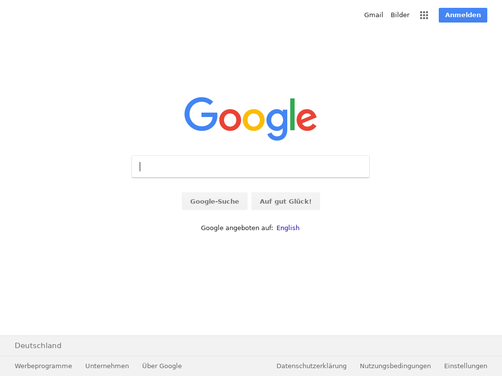

## Puppeteer AWS Lambda screenshot service
[](http://www.serverless.com)


Screenshot service running Headless-Chrome by [Puppeteer](https://github.com/GoogleChrome/puppeteer) on AWS Lambda.

Demo available [here](https://iv9yprrg22.execute-api.eu-central-1.amazonaws.com/prod?url=http://google.com&width=1024&height=768)



✔️ No binary checked-in

✔️ No lambda layer required

✔️ Runs locally with serverless-offline


Locally service works with `puppeteer`, packaged version contains uses `puppeteer-core` instead. With this workaround service able to work locally on any environment and at the same time have acceptable build size (~38Mb)

# Prerequisites

- Node.js
- yarn 
- serverless cli (install with `npm i -g serverless`)

# Installation


- Clone this repository

```
git clone https://github.com/EugeneDraitsev/screenshot-service.git
```

- Install dependencies

```
yarn
```

- Deploy the service

```
sls deploy --stage prod
```

# Custom domain

To customize the domain use [serverless-domain-manager](https://www.npmjs.com/package/serverless-domain-manager) plugin

# API

This service exposes a single HTTP GET endpoint that given the url returns a screenshot.
